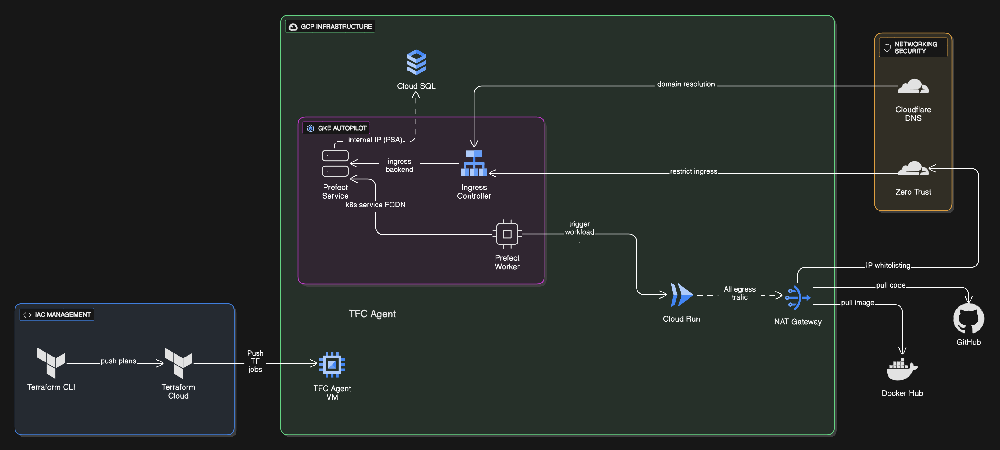

# Prefect Infra on GKE Autopilot

## Infrastructure Setup
### Terraform, Terraform Cloud & Terraform Agent
Infrastructure should be managed as code (IaC).

1. **Terraform as the Provisioning Tool** – Adopt Terraform as the primary mechanism for defining and deploying infrastructure.
2. **Remote Operations & State** – Use the Terraform Cloud free tier for remote runs and centralized state storage.
3. **Workspace Segmentation** – Create a dedicated Terraform Cloud workspace for each infrastructure component.
4. **Terraform Cloud Agent on GCP** –
    - Deploy a lightweight, free‑tier VM in Google Cloud Platform that registers with Terraform Cloud.
    - Keep all communication on the internal VPC network to enhance reliability and security.
    - Assign a static IP so GCP firewall rules can restrict traffic to this agent.
### GKE Autopilot
GKE Autopilot provides a production‑grade, fully managed Kubernetes platform.

1. **Covered Management Fees** – Current GCP credits are sufficient to pay the management fee for one Autopilot cluster.
2. **Pay‑for‑Usage** – Charges apply only to the compute resources actually consumed by running Pods.
3. **Bursting for High‑Density Workloads** – Autopilot supports burst capacity at no additional management cost, enabling pods to start small and scale cost‑effectively.
4. **Spot Pods** – Optionally leverage Spot Pods for further savings.
### Cloud SQL for PostgreSQL
Cloud SQL offers a production‑ready PostgreSQL database service.

- Although there is no free tier, a shared‑CPU micro instance is inexpensive.
- Compute resources can be upgraded in place as demand grows, with no data loss.
- Enabling Private Service Access (PSA) allows GKE Pods (e.g., the Prefect server) to reach the database via an internal IP.
### Cloudflare DNS & Zero Trust
- Manage DNS records with Cloudflare.
- Protect the Prefect server using Cloudflare Zero Trust, enforcing IP allow‑lists for critical services.
### Google Cloud Run
Google Cloud Run is a fully managed serverless compute platform billed purely on consumption.

- Generous monthly free credits typically cover Prefect workloads.
- All jobs egress through NAT using a static IP, enabling Cloudflare Zero Trust to whitelist outbound traffic.
## Deployment
### Prefect Server
- Deploy via the official Helm chart.
- Expose a single public ingress secured by Cloudflare Zero Trust.
- Connect to Cloud SQL over the internal IP.
### Prefect Workers
- Deploy the official Helm chart in the same namespace as the server.
- Access the server using its Kubernetes service FQDN.
### Runtime Environment
- User workloads run on Cloud Run.
- Because the Prefect Helm chart supports only one ingress, only the public ingress is configured.
- Cloud Run workloads communicate with the Prefect server via the public endpoint secured by Cloudflare.

### Infra Design Diagram

## Terrafrom Cloud Setup

Document about how to setup tfc for this project -> [here](./documents/01.terraform_cloud_setup.md)